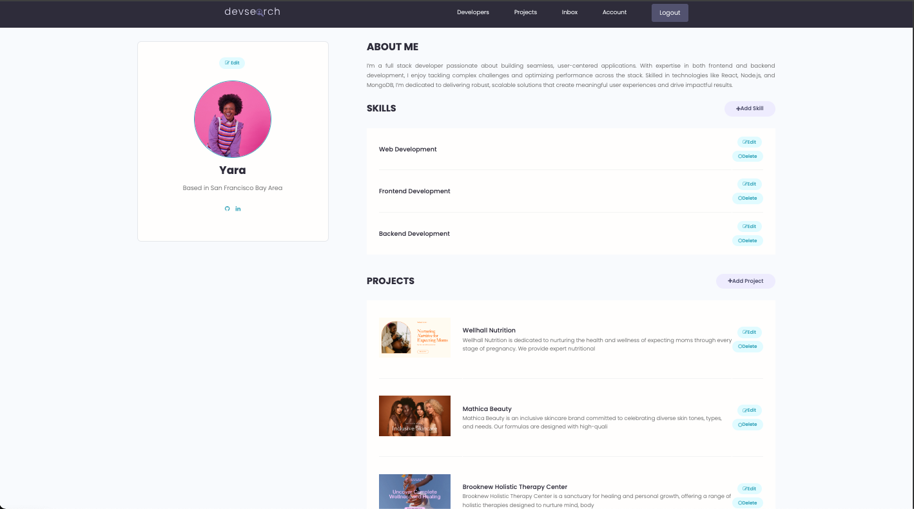

# DevSearch

## Project Overview

DevSearch is a full-stack web platform that connects developers with open projects. The platform serves as a central hub where developers can discover projects, showcase their work, provide feedback to help bring projects to completion and build meaningful connections within the development community.

## Motivation

### The primary goals of this project were to:

- Practice and demonstrate full-stack web development skills using Python and Django
- Implement user authentication and secure messaging functionality.
- Gain hands-on experience with PostgreSQL and backend data management.

## Tech Stack 

### Frontend

    - Django
    - Bootstap 
    - Python

### Backend

    - PostgreSQL

## Key Features

- User Registration and Authenticaton 
- User Profiles
- Showcase Skills and Projects
- Rate and comment on other developers' projects
- Messaging system
- Browse open projects and view detailed project descriptions
- Create, edit, and delete project details

## Login Page

## Home Page

## Profile Page

## Projects Page

## User Inbox

## Learning Outcomes

- Building a full-stack web application using Django
- Implementing a secure user authentication system
- Creating a functional messaging feature for real-time collaboration
- Managing and querying data efficiently with PostgreSQL
- Understanding and applying RESTful API principles in web development

## Credit

Credit to a course by [Dennis Ivy](https://dennisivy.teachable.com/p/django-beginners-course)
  
## Future Improvements

- Real-time chat functionality using WebSockets.
- Implementing advanced search filters for developers and projects
- Mobile-responsive design for better accessibility on all devices
